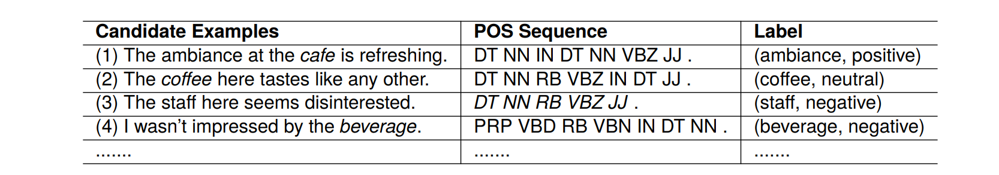
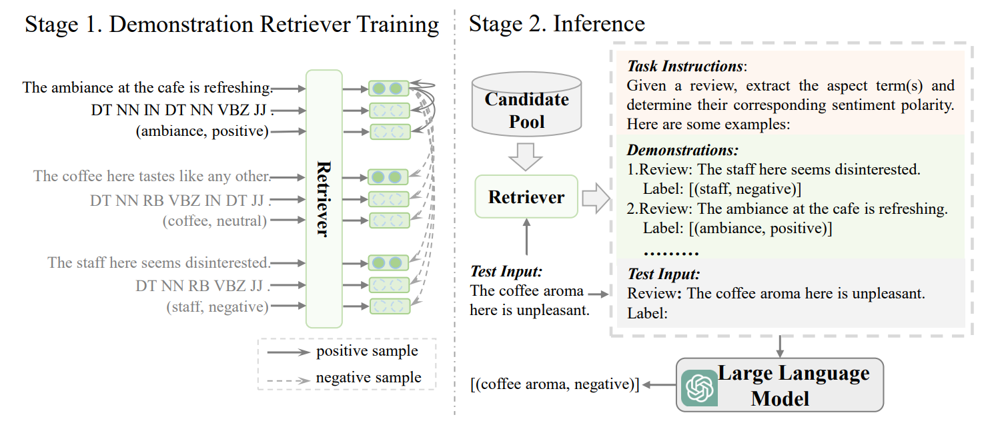

## In-Context Example Retrieval from Multi-Perspectives for Few-Shot Aspect-Based Sentiment Analysis

---

### Abstract

In this paper, we focus on few-shot aspect-based sentiment analysis (ABSA) and try to solve it with in-context learning (ICL) paradigm. However,

* the effectiveness of ICL is highly affected by retrieved in-context examples.

Previous works generally leverage the semantic similarity between the candidate examples and test input to retrieve examples. However, they may yield sub-optimal results for this task. This is because considering only the overall semantic perspective may leave some useful examples, which have syntactic structural relevance to the test input or share identical sentiments and similar aspects to one unretrievable.

  

To address this shortcoming,

* we advocate retrieving in-context examples for few-shot ABSA by simultaneously considering three perspectives, overall semantics, syntactic structure relevance, and aspect-sentiment semantics.
* we construct positive and negative pairs from these three perspectives and train the demonstration retriever using contrastive learning.

Experimental results on four ABSA datasets show that our retrieval framework can significantly outperform baselines across the board. 

### Overview

  

Figure 1 depicts the proposed framework that comprises two stages.

1) We construct positive and negative sample pairs from three perspectives to train the demonstration retriever via contrastive learning.
2) For each test input, the trained retriever is exploited to retrieve k-shot valuable incontext examples from the candidate pool. These retrieved examples along with task instructions and test input are fed to LLM for inference.

### Main Results

  

---

### Follow the steps below to run the code:

1. download pre-trained model weights from [huggingface](https://huggingface.co/docs/transformers/model_doc/bert), and put it in `./pretrain_models` directory
2. download data according to references
3. use large models to inference (some code can see [llama-13b-chat](https://huggingface.co/huggyllama)
4. install packages (see `requirements.txt`)
5. run `.our_multi_view_contrasive.py`

---
